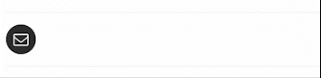

# A Cool Responsive Email Button

>
> 
>

## Here are using the languages as below.
- [x] HTML
- [x] CSS
- [x] JAVASCRIPT

This example is quite simple using CSS, the class "active" allowed to control the animation.

```JavaScript
$( ".button" ).click(function() {
  $( "div.button" ).hide();
  $( "div.form_box" ).addClass('active');
  setTimeout(function(){ $( "input[name=email]" ).addClass('active'); }, 500);
});
```

> Just have fun and enjoy yourself! :grin:
